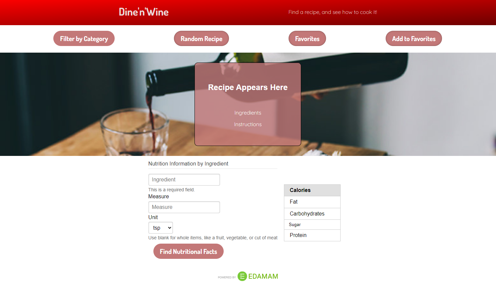

# dine-n-wine

## Purpose
A website that allows users to pick a recipe of their chosing, save some favorite recipes, and find out nutritional information about the ingredients

## Built With:
* Html
* CSS
* JavaScript
* Pure CSS (framework)
* Google Fonts
* Edamam API
* TheMealdb API

## Website
https://cesarsiguencia.github.io/dine-n-wine/

## Repository
https://github.com/cesarsiguencia/dine-n-wine/

## Image

## Contributors
Cesar Siguencia, Patrick Fernbach, Merry Chu, Alex Chang

